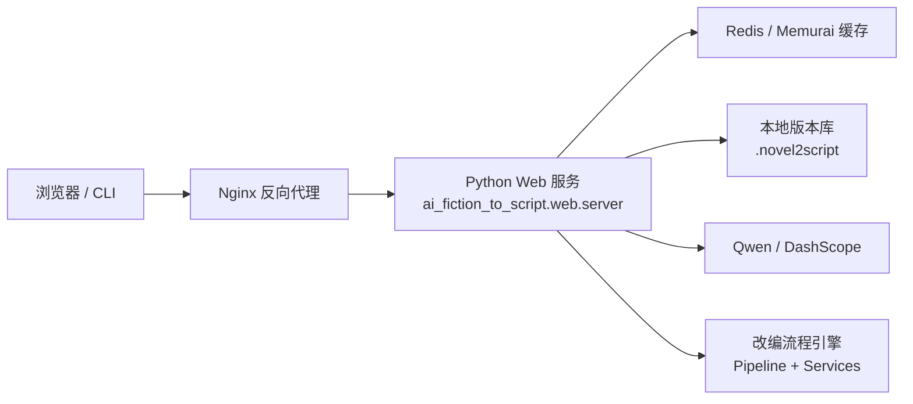

# AI 小说转剧本工具

`AI Fiction to Script` 是一个基于 Qwen 的小说改编系统，用来把原始小说文本转换成结构化、可编辑的 YAML 剧本草稿。它同时提供命令行工作流、浏览器工作台、本地版本管理，以及场景级重生成能力，适合做快速草稿生成、反复迭代和版本对比。

## 当前版本

- `v0.4.0`
- 当前分支已支持 `Nginx` 反向代理、`Redis` 缓存，以及 Windows 本地联调方案 `Nginx + Memurai + App`

## 技术方案

系统当前采用以下组合：

- `Python 3.12`：主运行环境
- `Qwen / DashScope`：在线生成模型
- `HybridAIClient`：Web 模式下使用本地启发式做分析、大纲、质检，只保留场景正文走 Qwen，优先减少等待时间
- `ThreadingHTTPServer`：当前应用服务入口
- `Redis`：缓存项目列表、版本列表、版本详情、diff 等读接口
- `Nginx`：反向代理统一入口
- `Memurai`：Windows 下的 Redis 兼容运行时，用于本地联调

## 整体架构



### Web 请求链路

1. 用户通过浏览器访问 `Nginx`
2. `Nginx` 把请求转发到 Python Web 服务
3. Web 服务优先读取 `Redis` 缓存
4. 缓存未命中时再读取本地版本库或触发生成流程
5. 生成流程只在必要步骤调用 Qwen
6. 写入新版本后，按项目失效缓存，再返回最新结果

### 缓存策略

当前缓存覆盖以下读接口：

- 项目列表
- 版本列表
- 单版本详情
- 版本 diff

以下写操作会触发按项目失效：

- `adapt`
- `save_edited_yaml`
- `regenerate_scene`

## 核心能力

- 把小说内容转换为结构化 YAML 剧本草稿
- 保留章节引用，方便追溯原文来源
- 为每次生成结果保存本地版本
- 支持版本差异比较
- 支持单场景重生成，无需整项目重跑
- 支持在浏览器工作台中直接查看、下载和调整结果
- Web 模式支持更快的草稿生成路径，优先减少等待时间
- 支持 `Nginx + Redis` 部署和 Windows 本地三层联调

## 目录结构

- `src/ai_fiction_to_script/models/`：Pydantic 数据模型与运行时模型
- `src/ai_fiction_to_script/services/`：解析、生成、校验、版本管理、缓存与工作台服务
- `src/ai_fiction_to_script/pipeline/`：改编流程编排引擎
- `src/ai_fiction_to_script/web/`：轻量 Web 服务与静态前端资源
- `deploy/nginx/`：Docker / Linux 部署用 Nginx 配置
- `deploy/windows/`：Windows 本地联调用 `Memurai` 和 `Nginx` 配置
- `scripts/`：本地启动脚本，例如 `run_local_stack.ps1`
- `runtime/`：本地运行时目录，放置 `nginx`、`Memurai` 等二进制
- `examples/`：示例输入
- `schemas/`：导出的 Schema
- `tests/`：CLI、Pipeline、Web API、缓存与工作台测试
- `docs/`：架构与 Schema 文档
- `.novel2script/`：剧本本地版本库

## 安装

```bash
pip install -e .
```

如果之前安装过旧版本的可编辑包，拉取最新代码后建议重新执行一次安装命令，确保 `novel2script web` 等入口与当前源码保持一致。

## Qwen 配置

调用在线 Qwen 之前，请先设置 DashScope / Qwen API Key：

```bash
set DASHSCOPE_API_KEY=your_key_here
```

可选环境变量：

- `QWEN_BASE_URL`
- `QWEN_TIMEOUT_SECONDS`

如果你的账号不在默认地域，需要把 `QWEN_BASE_URL` 设置成对应地域的 DashScope OpenAI 兼容地址。

## CLI 运行方式

从文本文件生成剧本草稿：

```bash
novel2script adapt examples/sample_novel.txt --title 老街回声 --original-author 测试作者 --project-id demo-project
```

查看已保存版本：

```bash
novel2script list-versions demo-project
```

重生成单个场景：

```bash
novel2script regenerate-scene demo-project v0001 s001 --instruction "强化主角的紧迫感。"
```

导出 JSON Schema：

```bash
novel2script export-schema --output schemas/screenplay.schema.json
```

## Web 工作台运行方式

直接启动 Web 服务：

```bash
novel2script web --host 127.0.0.1 --port 8098
```

然后在浏览器中打开：

```text
http://127.0.0.1:8098
```

工作台支持：

- 通过文件上传或直接粘贴小说文本生成剧本
- 浏览项目与版本
- 查看最终生成剧本
- 下载 YAML 结果
- 按修改要求进行场景重生成
- 查看重生成前后对比
- 在 `中文` 与 `English` 界面之间切换

补充说明：

- 现在支持单章或多章文本输入，但多章输入通常会得到更稳定的结果
- Web 模式默认优先走更快的生成路径，但真实 Qwen 生成速度仍受网络和模型响应影响

## Docker 运行方式

当前仓库已经提供 `Dockerfile` 和 `docker-compose.yml`，可直接启动 `Nginx + App + Redis`：

```bash
docker compose up --build
```

启动后访问：

```text
http://127.0.0.1:8080
```

## Windows 本地三层运行方式

当前已支持 Windows 本地联调，不依赖 Docker，结构为：

- `Memurai`：本地 Redis 兼容缓存
- Python Web 服务：运行在 `py312` 环境
- `Nginx for Windows`：本地反向代理

启动脚本：

```powershell
.\scripts\run_local_stack.ps1
```

默认端口：

- `Memurai`：`127.0.0.1:6380`
- 应用服务：`http://127.0.0.1:8099`
- `Nginx` 入口：`http://127.0.0.1:8088`

浏览器访问：

```text
http://127.0.0.1:8088
```

说明：

- 为了避开 Windows 版 `nginx.exe` 对中文路径的兼容问题，本地脚本会把 `Nginx` 暂存到 `%TEMP%\ai-fiction-to-script-localstack`
- 本地脚本使用隔离端口，避免和机器上已有的 `8098 / 8080 / 6379` 服务冲突

## 缓存配置

缓存相关环境变量：

- `WEB_CACHE_ENABLED`
- `REDIS_URL`
- `WEB_CACHE_TTL_SECONDS`
- `WEB_CACHE_KEY_PREFIX`

运行中的服务可通过 `/api/health` 查看当前缓存后端：

- `disabled`
- `redis`

## 本地版本管理

工具内部维护两层版本：

- 源代码版本：Git 分支、提交和标签
- 剧本产物版本：`.novel2script/<project>/versions/v000x/`

每个保存版本包含：

- `screenplay.yaml`
- `screenplay.json`
- `intermediates/*.json`
- `index.json`

## 校验与测试

运行测试：

```bash
python -m pytest -q
```

## 文档

- [架构说明](docs/ARCHITECTURE.md)
- [YAML Schema 说明](docs/YAML_SCHEMA.md)
- [变更记录](CHANGELOG.md)
